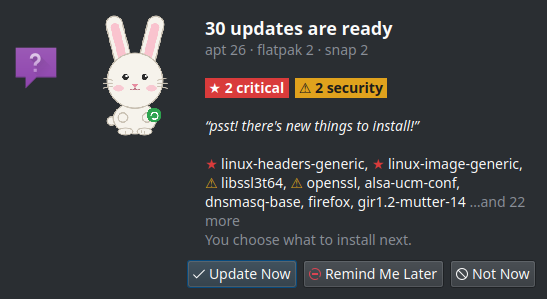
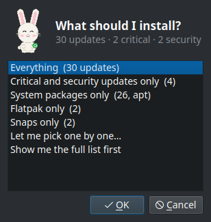
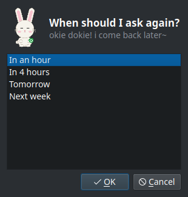
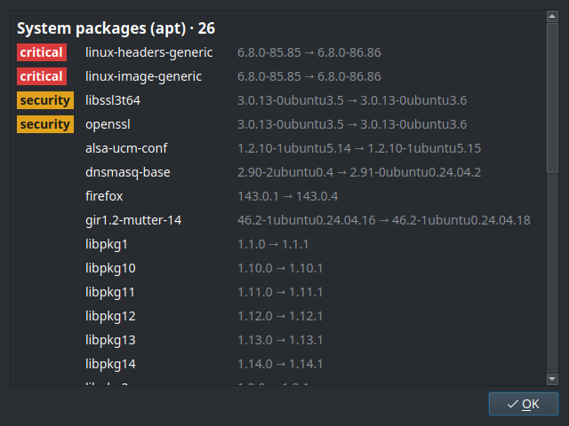
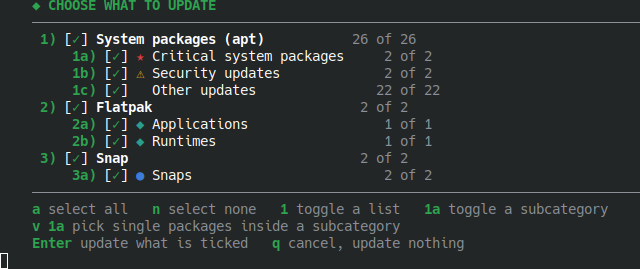

# nudge

<p align="center">
  
</p>
<p align="center"><i>a gentle nudge to keep your system fresh</i></p>

[](https://github.com/otmof-ops/nudge/actions/workflows/validate-pr.yml)
[](https://github.com/otmof-ops/nudge/releases)
[](LICENSE)
[](tests/)
[](nudge.sh)
[](docs/STANDARDS.md)

**A gentle nudge to keep your system fresh.**

Lightweight Linux desktop update manager that checks for available packages after login, asks if you'd like to update, and then lets you pick exactly what: every list of updates (system packages, Flatpak, Snap) with its subcategories, select-all at each level, or single packages. Supports multiple distributions and package managers (apt, dnf, pacman, zypper), 5 notification backends, Flatpak and Snap stores, scheduling with deferral, pre-upgrade snapshots, and a friendly bunny mascot. Pure bash. Zero compiled dependencies. 435 tests.

## Beta Testing

nudge is in active development and publicly available for early adopters. If you're running a Linux desktop and want to help improve it, install it, use it, and report what breaks. Bug reports, edge cases, quirky distro behaviour, notification backends not cooperating — all of it is useful.

**How to help:**

1. Install nudge on your daily driver (see [Quick Start](#quick-start))
2. Use it normally — let it run at login, try the different notification backends, test scheduling and deferral
3. File issues at [github.com/otmof-ops/nudge/issues](https://github.com/otmof-ops/nudge/issues) with your distro, desktop environment, and what happened vs what you expected

The more variety of setups it gets tested on, the faster it stabilises. Every bug report helps.

## Why nudge?

Most Linux update tools are either silent and automatic, locked to one desktop environment, or require heavyweight runtimes. nudge is a lightweight system update notification tool that asks before acting — a consent-first Linux update manager built for every desktop.

| Feature | nudge | unattended-upgrades | GNOME Software | topgrade |
|---------|-------|--------------------|--------------------|----------|
| Asks before updating | **Yes** | No (auto) | Yes | No (runs all) |
| Multi-distro | **4 pkg mgrs** | Debian only | GNOME only | Multi |
| Flatpak + Snap | **Yes** | No | Partial | Yes |
| Lightweight (pure bash) | **Yes** | Yes | No | No (Rust) |
| Notification backends | **5** | 0 | 1 | 0 |
| Scheduling + deferral | **Yes** | Yes | No | No |
| Pre-upgrade snapshots | **Yes** | No | No | No |
| Test suite | **435** | — | — | — |

## Features

- **Consent-first updates** — never updates without your explicit approval; Update Now, Remind Later, or Not Now
- **Dialogs with the bunny in them** — the prompt draws the Nudge Bunny in the mood of the moment, the counts, red and amber chips for critical and security updates, and the first package names; kdialog gets rich text, zenity the same in Pango markup
- **Pick what to update** — after Update Now, one question: everything, critical and security updates only, one source only, the full list first, or pick one by one; picking one by one opens the menu in a terminal window (every source with its subcategories, select-all at each level, single packages), and only what you tick is applied, with `sudo` asking for your password in that window
- **Multi-distro support** — auto-detects apt, dnf, pacman, and zypper across Ubuntu, Fedora, Arch, and openSUSE
- **5 notification backends** — dunstify, kdialog, zenity, gdbus, and notify-send with automatic detection
- **Flatpak + Snap** — checks universal package stores alongside your system package manager
- **Scheduling and deferral** — login, daily, or weekly checks with customizable "remind me later" intervals
- **Pre-upgrade snapshots** — optional timeshift, snapper, or btrfs snapshots before every update
- **Security priority classification** — highlights critical and security updates (kernel, openssl, glibc, sudo)
- **Friendly mascot** — the Nudge Bunny, an SVG character with seven moods that is the dialog icon, plus 100+ rotating dialogue lines (and a text bunny where only text can go)
- **JSON output** — structured output for scripting, waybar/polybar integration, and automation
- **JSONL history** — searchable update history with date filtering
- **Zero telemetry** — no data collection, no phone-home, fully auditable source
- **User-space install** — everything lives in `~/.local/`, no root persistence, no daemon

## Quick Start

**One-liner install:**

```bash
bash <(curl -fsSL https://raw.githubusercontent.com/otmof-ops/nudge/main/setup.sh) --install --defaults
```

**Or clone and run the setup TUI:**

```bash
git clone https://github.com/otmof-ops/nudge.git
cd nudge
./setup.sh
```

That's it. nudge will notify you at next login when updates are available.

**Verified install from a release:** every release ships the scripts with a `SHA256SUMS`, and the
installed copy verifies them again on every self-update. To start from a verified tree instead of the
one-liner:

```bash
git clone --branch v2.2.0 https://github.com/otmof-ops/nudge.git && cd nudge && ./setup.sh --install --defaults
```

## How It Works

```
Login/Timer → nudge.sh → load config → acquire lock → schedule guard → delay →
network probe (curl/wget/ping) → detect package manager → lock check →
count updates (system + flatpak + snap) → if 0: exit → classify by priority →
show the prompt (the bunny, the counts, the first names) →
"Update Now": what to install? (everything / critical + security / one source /
the full list first / pick one by one) → terminal window: [the menu] → snapshot →
upgrades (system, Flatpak, Snap) → reboot check |
"Remind Me Later": when? (in an hour, tomorrow…) | "Not Now": exit →
write history → exit with the named code (0 under login or timer)
```

## Architecture

nudge uses a modular library design — the main script is a ~500-line dispatcher that sources 16 modules from `lib/`:

| Module | Purpose |
|--------|---------|
| `lib/output.sh` | Exit codes, logging, JSON output, content rendering |
| `lib/config.sh` | Safe config parser, validation, migration |
| `lib/lock.sh` | flock-based instance locking |
| `lib/network.sh` | Multi-method network probe (curl/wget/ping) |
| `lib/pkgmgr.sh` | apt/dnf/pacman/zypper + flatpak + snap |
| `lib/notify.sh` | dunstify/kdialog/zenity/gdbus/notify-send backends |
| `lib/dialog.sh` | What the dialogs show: rich text and Pango bodies with the mascot, the scope picker, the full list, the deferral and restart dialogs |
| `lib/schedule.sh` | Scheduling, interval guards, deferral |
| `lib/history.sh` | JSONL history log and viewer |
| `lib/safety.sh` | Pre-upgrade snapshots, reboot detection |
| `lib/selfupdate.sh` | GitHub release self-update check |
| `lib/errorreport.sh` | Crash reports and automated GitHub issue filing |
| `lib/tui.sh` | TUI rendering — the palette (truecolor, 256 or 16 colours), frames, menus, the text bunny |
| `lib/select.sh` | The selection menu — lists, subcategories, select-all, single packages |
| `lib/bunny-poses.sh` | The mascot — faces and 11 ASCII art poses |
| `lib/bunny-dialogue.sh` | 100+ rotating dialogue messages, random picker |
| `lib/bunny.sh` | Bunny orchestrator — render, season, context, state |

## Supported Distributions

| Distribution | Package Manager | Status |
|-------------|----------------|--------|
| Ubuntu / Debian | `apt` | Full support |
| Fedora / RHEL | `dnf` | Full support |
| Arch Linux | `pacman` | Full support |
| openSUSE | `zypper` | Full support |
| Any (Flatpak) | `flatpak` | Auto-detected |
| Any (Snap) | `snap` | Auto-detected |

## Notification Backends

| Backend | Interactive | Defer | Auto-Dismiss | Detection Order |
|---------|------------|-------|--------------|-----------------|
| `dunstify` | Yes (actions) | Yes | Yes | 1st |
| `kdialog` | Yes (dialog) | Yes | Yes (timeout) | 2nd |
| `zenity` | Yes (dialog) | Yes | Yes (native) | 3rd |
| `gdbus` | Passive | No | Yes | 4th |
| `notify-send` | Passive | No | N/A | 5th |

## Requirements

- Linux desktop with one of: apt, dnf, pacman, or zypper
- One of: dunstify, kdialog, zenity, gdbus, or notify-send
- A terminal emulator (konsole, gnome-terminal, xfce4-terminal, alacritty, kitty, foot, wezterm, tilix, terminator, or xterm)
- Optional: flatpak, snap, timeshift/snapper (for snapshots)

## Install

### Interactive Setup (Recommended)

```bash
git clone https://github.com/otmof-ops/nudge.git
cd nudge
./setup.sh
```

The unified TUI walks you through install, configure, update, and uninstall — all guided by the Nudge Bunny.

### Quick Install (defaults)

```bash
./setup.sh --install --defaults
```

### Scripted / Unattended Install

```bash
./setup.sh --install --unattended
```

### One-Liner from GitHub

```bash
bash <(curl -fsSL https://raw.githubusercontent.com/otmof-ops/nudge/main/setup.sh) --install --defaults
```

### Upgrade from v1.x

```bash
./setup.sh --install --upgrade
```

Preserves your existing config, runs migration to add new keys with defaults.

### Setup Options

| Flag | Description |
|------|-------------|
| `--install` | Install nudge |
| `--uninstall` | Uninstall nudge |
| `--update` | Check and install updates |
| `--config-only` | Open configure flow only |
| `--defaults` | Skip prompts, use default settings |
| `--unattended` | Non-interactive install (implies `--defaults`) |
| `--upgrade` | In-place upgrade, preserve config |
| `--systemd` | Use systemd user timer for autostart |
| `--xdg` | Use XDG autostart entry |
| `--no-color` | Disable colored output |
| `--prefix=PATH` | Custom install prefix (default: `$HOME`) |
| `--dry-run` | Show what would happen, change nothing |
| `--keep-config` | Uninstall: preserve config directory |
| `--check` | Update: just check, print version, exit |

Legacy `install.sh` and `uninstall.sh` wrappers are still supported for backward compatibility.

### Installed Files

| File | Purpose |
|------|---------|
| `~/.local/bin/nudge.sh` | Main dispatcher script (`~/.local/bin/nudge` links to it) |
| `~/.local/lib/nudge/*.sh` | Library modules (17) |
| `~/.local/lib/nudge/mascot/*.svg` | The Nudge Bunny's eight moods, drawn into the dialogs |
| `~/.config/nudge/nudge.conf` | Configuration (32 keys) |
| `~/.config/autostart/nudge.desktop` | XDG autostart entry |
| `~/.config/systemd/user/nudge.timer` | systemd timer (if selected) |
| `~/.config/systemd/user/nudge.service` | systemd service (if selected) |
| `~/.local/share/bash-completion/completions/nudge` | Bash completion |
| `~/.local/share/man/man1/nudge.1` | Man page |
| `~/.local/share/icons/hicolor/scalable/apps/nudge.svg` | The Nudge Bunny, used as the dialog icon |
| `~/.local/share/nudge/` | History, state, deferral files |

## Uninstall

```bash
./setup.sh --uninstall
```

Or via the TUI: run `./setup.sh` and choose option 2.

Shows what will be removed and asks for confirmation. Cleans up systemd timer, bash completion, man page, history, and state files.

| Flag | Description |
|------|-------------|
| `--yes`, `-y` | Skip confirmation prompts |
| `--keep-config` | Preserve `~/.config/nudge/` |
| `--no-color` | Disable colored output |

## Configuration

Edit `~/.config/nudge/nudge.conf`:

### Core Settings

| Option | Type | Default | Description |
|--------|------|---------|-------------|
| `ENABLED` | bool | `true` | Enable or disable nudge |
| `DELAY` | int | `45` | Seconds to wait after login |
| `CHECK_SECURITY` | bool | `true` | Highlight security updates |
| `AUTO_DISMISS` | int | `0` | Auto-dismiss dialog (seconds, 0 = never) |
| `UPDATE_COMMAND` | string | `sudo apt update && sudo apt full-upgrade` | Update command, used when every system package is selected |
| `SELECT_UPDATES` | bool | `true` | Show the selection menu after Update Now; `false` runs the update command straight away |

### Network Settings

| Option | Type | Default | Description |
|--------|------|---------|-------------|
| `NETWORK_HOST` | string | `archive.ubuntu.com` | Connectivity check host |
| `NETWORK_TIMEOUT` | int | `5` | Check timeout (seconds) |
| `NETWORK_RETRIES` | int | `2` | Retry count |
| `OFFLINE_MODE` | enum | `skip` | `skip` / `notify` / `queue` |

### Notification Settings

| Option | Type | Default | Description |
|--------|------|---------|-------------|
| `NOTIFICATION_BACKEND` | enum | `auto` | `auto`/`kdialog`/`zenity`/`dunstify`/`gdbus`/`notify-send`/`none` |
| `DUNST_APPNAME` | string | `nudge` | App name for dunst |
| `PREVIEW_UPDATES` | bool | `true` | Show the first package names in the prompt (the full list is always a click away) |
| `SECURITY_PRIORITY` | bool | `true` | Show critical/security packages first |

### Schedule Settings

| Option | Type | Default | Description |
|--------|------|---------|-------------|
| `SCHEDULE_MODE` | enum | `login` | `login` / `daily` / `weekly` |
| `SCHEDULE_INTERVAL_HOURS` | int | `24` | Hours between checks |
| `DEFERRAL_OPTIONS` | string | `1h,4h,1d` | "Remind me later" choices |

### Package Manager Settings

| Option | Type | Default | Description |
|--------|------|---------|-------------|
| `PKGMGR_OVERRIDE` | string | *(empty)* | Force specific package manager |
| `FLATPAK_ENABLED` | enum | `auto` | `true` / `false` / `auto` |
| `SNAP_ENABLED` | enum | `auto` | `true` / `false` / `auto` |

### History & Logging

| Option | Type | Default | Description |
|--------|------|---------|-------------|
| `HISTORY_ENABLED` | bool | `true` | Write history records |
| `HISTORY_MAX_LINES` | int | `500` | Rotate history at this count |
| `LOG_FILE` | string | *(empty)* | Log file path (empty = none) |
| `LOG_LEVEL` | enum | `info` | `debug` / `info` / `warn` / `error` |
| `JSON_OUTPUT` | bool | `false` | Default to JSON output |

### Safety Settings

| Option | Type | Default | Description |
|--------|------|---------|-------------|
| `REBOOT_CHECK` | bool | `true` | Detect reboot needed post-upgrade |
| `SNAPSHOT_ENABLED` | bool | `false` | Snapshot before upgrade |
| `SNAPSHOT_TOOL` | enum | `auto` | `auto` / `timeshift` / `snapper` / `btrfs` |

### Self-Update Settings

| Option | Type | Default | Description |
|--------|------|---------|-------------|
| `SELF_UPDATE_CHECK` | bool | `true` | Check for newer nudge version |
| `SELF_UPDATE_CHANNEL` | enum | `stable` | `stable` / `beta` |

### Personality Settings

| Option | Type | Default | Description |
|--------|------|---------|-------------|
| `BUNNY_PERSONALITY` | enum | `disney` | `classic` (neutral) / `disney` (bubbly baby-talk) |

### Terminal and Classification

| Option | Type | Default | Description |
|--------|------|---------|-------------|
| `TERMINAL_EMULATOR` | string | `auto` | Terminal for the update session (a program name such as `konsole` or `kitty`) |
| `CRITICAL_PACKAGES_EXTRA` | string | *(empty)* | Extra package names to classify as CRITICAL, separated by `\|` |

## CLI Flags

```bash
nudge --version              # Print version
nudge --help                 # Show help
nudge --dry-run              # Run checks, no dialogs
nudge --check-only           # Print update count
nudge --check-only --json    # JSON output
nudge --verbose              # Verbose logging
nudge --history              # Show last 20 history records
nudge --history 50           # Show last 50 records
nudge --history --json       # Raw JSONL dump
nudge --history --since DATE # Filter by date
nudge --defer 4h             # Defer next check
nudge --self-update          # Download latest version
nudge --config               # Print resolved config
nudge --validate             # Validate config
nudge --report               # Show crash reports
nudge --report --file        # File latest crash as GitHub issue
nudge --report --clear       # Clear all crash reports
nudge --migrate              # Run config migration
```

## Exit Codes

| Code | Constant | Meaning |
|------|----------|---------|
| 0 | `EXIT_OK` | No updates / completed |
| 1 | `EXIT_UPDATES_DECLINED` | User said "Not Now" |
| 2 | `EXIT_UPDATES_APPLIED` | Updates ran successfully |
| 3 | `EXIT_UPDATES_FAILED` | Update command failed |
| 4 | `EXIT_DISABLED` | ENABLED=false |
| 5 | `EXIT_NETWORK_FAIL` | Network check failed |
| 6 | `EXIT_PKG_LOCK` | Package manager locked |
| 7 | `EXIT_ALREADY_RUNNING` | Another instance running |
| 8 | `EXIT_NO_BACKEND` | No notification backend |
| 9 | `EXIT_DEFERRED` | User chose "Remind later" |
| 10 | `EXIT_CONFIG_ERROR` | Config validation failed |
| 11 | `EXIT_INTERRUPTED` | SIGINT/SIGTERM/SIGHUP |
| 12 | `EXIT_SNAPSHOT_FAILED` | Snapshot failed, aborted |
| 13 | `EXIT_REBOOT_PENDING` | Reboot required |

Under the login or timer trigger (the autostart entry and the systemd unit set `_NUDGE_TRIGGER`), the ordinary outcomes 1, 2, 4, 5, 9 and 13 exit 0, so the autostart service never shows as failed because you clicked Not Now. The history and the JSON keep the real code, and a manual run still exits with it.

## JSON Output

With `--json`, nudge emits a single JSON object:

```json
{
  "nudge_version": "2.2.0",
  "timestamp": "2026-10-09T09:15:00+08:00",
  "exit_code": 2,
  "exit_reason": "UPDATES_APPLIED",
  "pkg_manager": "apt",
  "updates": {"total": 14, "security": 3, "critical": 1, "flatpak": 2, "snap": 0},
  "packages": [{"name": "openssl", "from": "3.0.10", "to": "3.0.11", "priority": "CRITICAL", "arch": "amd64", "security": true}],
  "selected": {"system": 12, "flatpak": 2, "snap": 0},
  "reboot_required": false,
  "snapshot_id": null,
  "deferred": false,
  "duration_seconds": 4
}
```

## Scheduling

| Mode | Behavior |
|------|----------|
| `login` (default) | Check every login |
| `daily` | Check once per `SCHEDULE_INTERVAL_HOURS` |
| `weekly` | Check once per `SCHEDULE_INTERVAL_HOURS × 7` |

Use XDG autostart (default) or systemd user timer:

```bash
./install.sh --systemd   # Install with systemd timer
./install.sh --xdg       # Install with XDG autostart
```

## The Dialogs

<p align="center"></p>

The prompt says how many updates there are and where from, flags the critical and security ones, lets the bunny say its line, and names the first few (critical and security first). Three buttons: **Update Now**, **Remind Me Later**, **Not Now**.

<p align="center">&nbsp;&nbsp;</p>

**Update Now** asks one more question: everything, the critical and security updates only, one source only (offered when there are several), **pick one by one** (the terminal menu below), or **show the full list first** (every update grouped by source, with versions). **Remind Me Later** asks when, in plain words, from `DEFERRAL_OPTIONS`.

<p align="center"></p>

kdialog draws all of this as rich text with the bunny in it; zenity shows the same text in Pango markup with the bunny as the window icon; dunstify, gdbus and notify-send get the plain text. Every package name is escaped before it reaches the markup.

## The Selection Menu

Picking one by one opens a terminal window. Everything is ticked to start with; untick a whole list, a subcategory, or single packages, then press Enter:

<p align="center"></p>

```text
    ◆ CHOOSE WHAT TO UPDATE
    ────────────────────────────────────────────────────────────
     1) [✓] System packages (apt)              26 of 26
         1a) [✓] ★ Critical system packages       2 of 2
         1b) [✓] ⚠ Security updates               2 of 2
         1c) [✓]   Other updates                 22 of 22
     2) [✓] Flatpak                               2 of 2
         2a) [✓] ◆ Applications                   1 of 1
         2b) [✓] ◆ Runtimes                       1 of 1
     3) [✓] Snap                                  2 of 2
         3a) [✓] ● Snaps                          2 of 2
    ────────────────────────────────────────────────────────────
    a select all   n select none   1 toggle a list   1a toggle a subcategory
    v 1a pick single packages inside a subcategory
    Enter update what is ticked   q cancel, update nothing
```

With every system package ticked, `UPDATE_COMMAND` runs as configured (a full upgrade). With a subset, only those packages are upgraded (`apt-get install --only-upgrade`, `dnf upgrade`, `zypper update`). Arch never partially upgrades, so on pacman the system list is all or nothing. Flatpak and Snap follow the same rule with `flatpak update` and `snap refresh`. Set `SELECT_UPDATES=false` to skip both the question and the menu and install everything. The terminal picks its palette by what it reports: truecolor, 256 colours, or the basic 16.

## The Nudge Bunny

<p align="center"></p>

An SVG character drawn by [`docs/assets/make-mascot.sh`](docs/assets/make-mascot.sh) into `share/mascot/`; the dialogs draw it in the mood of the moment, and the same bunny is the app icon once installed. [docs/mascot.md](docs/mascot.md) has the moods, the assets and the text fallback.

## Development

### Run Tests

```bash
make test    # Requires bats-core
```

### Lint

```bash
make lint    # Requires shellcheck
```

### Man Page

```bash
man ./share/man/nudge.1    # Preview locally
```

## Troubleshooting

**nudge doesn't run at login:**
- Check autostart: `ls ~/.config/autostart/nudge.desktop` or `systemctl --user status nudge.timer`
- Verify `ENABLED=true` in `~/.config/nudge/nudge.conf`

**"No supported notification backend found":**
- Install a dialog tool: `sudo apt install kdialog` (KDE), `sudo apt install zenity` (GNOME/XFCE), or `sudo apt install dunst` (tiling WMs)

**Network check always fails:**
- Try a different `NETWORK_HOST` (e.g., `1.1.1.1`)
- Increase `NETWORK_TIMEOUT` and `NETWORK_RETRIES`
- Set `OFFLINE_MODE="notify"` to see when network is down

**Config errors:**
- Run `nudge --validate` to check config
- Run `nudge --config` to see resolved values
- Run `nudge --migrate` if upgrading from v1.x

**Package manager not detected:**
- Set `PKGMGR_OVERRIDE="apt"` (or dnf/pacman/zypper) in config

**The systemd timer never shows a dialog:**
- The user manager needs the session's display: `systemctl --user import-environment DISPLAY WAYLAND_DISPLAY XAUTHORITY` (KDE and GNOME do this for you). Without a display the run is skipped and recorded as `SKIPPED_NO_DISPLAY` in `nudge --history`.

**nudge keeps asking to reboot:**
- The reboot flag clears itself once the system has rebooted, or when nothing needs a reboot any more. If it persists, `nudge --dry-run --verbose` shows which signal is set.

## Safety

nudge runs your configured update command when you accept. Please read [SAFETY.md](docs/SAFETY.md) — it covers the risks of system updates, PPA concerns, and shared-account considerations.

## Security

To report a security vulnerability, **do not open a public issue.** See [SECURITY.md](.github/SECURITY.md) for the responsible disclosure process.

## Contributing

Contributions are welcome. See [CONTRIBUTING.md](docs/CONTRIBUTING.md) for the code conventions, the sign-off, and the PR process.

## Project Stats

| Metric | Value |
|--------|-------|
| Test suite | 435 tests across 17 files |
| Library modules | 16 modular `.sh` files |
| Named exit codes | 13 scriptable exit codes |
| Config keys | 32 validated keys |
| Notification backends | 5 with auto-detection |
| Package managers | 4 + Flatpak + Snap |
| Mascot | an SVG character with 7 moods, 11 text poses for terminals |
| Bunny dialogue lines | 100+ rotating messages |
| CI pipeline | ShellCheck + BATS on every PR |

## Project

- [ROADMAP.md](docs/ROADMAP.md) — Feature roadmap and deliberately out-of-scope items
- [CHANGELOG.md](docs/CHANGELOG.md) — Release history
- [CREDITS-AND-COMMUNITY.md](docs/CREDITS-AND-COMMUNITY.md) — Attribution and community
- [CODE_OF_CONDUCT.md](docs/CODE_OF_CONDUCT.md) — Community standards
- [STANDARDS.md](docs/STANDARDS.md) — Repository standards and conventions

## License

BSD 3-Clause, the standard permissive license with a non-endorsement clause. In plain words: use,
copy, change and sell nudge freely, including inside a distribution; every copy, source or binary,
keeps the copyright line, which names **Jay Taylor** and links to https://github.com/otmof-ops/nudge;
and that name may not be used to endorse or promote whatever you build from it. Everything in this
repository, documentation included, is under it; [REUSE.toml](REUSE.toml) says so per path. Full
text in [LICENSE](LICENSE).

Copyright (c) 2026 Jay Taylor (https://github.com/otmof-ops/nudge).

---

OFFTRACKMEDIA Studios — *Building Empires, Not Just Brands.*
