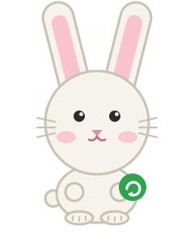

# nudge — The Nudge Bunny

The mascot is an SVG character: one set of shapes, seven moods, two poses,
drawn by `docs/assets/make-mascot.sh` so every asset is the same bunny.

<p align="center"></p>

## Where it appears

| Asset | File | Used for |
|-------|------|----------|
| The character | `docs/assets/bunny.svg` | README, docs |
| Moods | `docs/assets/bunny-{happy,wide,worried,sleepy,teary,crying}.svg` | docs, the mood sheet |
| Waving | `docs/assets/bunny-wave.svg` | greetings |
| The app icon | `share/icons/nudge.svg` | installed to `~/.local/share/icons/hicolor/scalable/apps/nudge.svg`; the dialogs (kdialog, zenity, dunst, notify-send) and the autostart entry show it |
| The mood sheet | `docs/assets/bunny-moods.svg` | this page |
| The social preview | `docs/assets/social-preview.svg`, `social-preview.png` | the repository's social card (1280×640); upload the PNG under Settings → Social preview |

## Moods

<p align="center"></p>

| Mood | When |
|------|------|
| normal | resting, the prompt |
| happy | updates applied, security updates done |
| wide | first run, a big update |
| worried | a reboot is needed |
| sleepy | nothing to do |
| teary | three or four declines in a row |
| crying | five or more |

## Regenerating the assets

```bash
docs/assets/make-mascot.sh
```

The script is plain bash and writes every SVG from the same palette and
shapes; edit the shapes there, not in the SVG files. The icon is the head and
ears on the green tile; the social preview is the happy bunny beside the
wordmark.

## Text fallback

Terminals and dialog bodies cannot draw SVG, so the setup TUI, `--help`, the
update session and the dialog text keep a three-line text bunny with the same
proportions and moods (`lib/bunny-poses.sh`):

```text
 (\__/)
 (='.'=)  message
 (")_(")  detail
```

The faces are the three characters inside the head (`'.'`, `^.^`, `o.o`,
`O.O`, `-.-`, `;.;`, `T.T`), the poses add paws, an edge or a star, and
seasons add a decoration to the first and last line.
