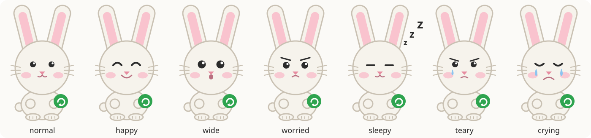

# nudge — The Nudge Bunny

The mascot is an SVG character: one set of shapes, seven moods, two poses,
drawn by `docs/assets/make-mascot.sh` so every asset is the same bunny.

<p align="center"></p>

## Where it appears

| Asset | File | Used for |
|-------|------|----------|
| The character | `share/mascot/bunny.svg` | the prompt (resting), README, docs |
| Moods | `share/mascot/bunny-{happy,wide,worried,sleepy,teary,crying}.svg` | the dialogs, by context; the mood sheet |
| Waving | `share/mascot/bunny-wave.svg` | the first run, and a return after a week away |
| The app icon | `share/icons/nudge.svg` | installed to `~/.local/share/icons/hicolor/scalable/apps/nudge.svg`; the window icon of every dialog, the notification icon, the autostart entry |
| The mood sheet | `docs/assets/bunny-moods.svg` | this page |
| The social preview | `docs/assets/social-preview.svg`, `social-preview.png` | the repository's social card (1280×640); upload the PNG under Settings → Social preview |
| The dialog screenshots | `docs/assets/screenshot-*.png` | the README; drawn by `docs/assets/make-screenshots.sh` on a virtual display |

`setup.sh` installs the character files to `~/.local/lib/nudge/mascot/`, and
`lib/dialog.sh` draws them into kdialog's rich text: 104 px tall in the prompt
and the restart dialog, 56 px in the pickers. zenity cannot draw an image in
its text, so there the bunny is the window icon and the line is the text.
Qt breaks a line at a hyphen or a space whatever the span says, so the names
in the prompt carry non-breaking ones; a name copied out of the dialog keeps
them, the terminal menu and the full list do not.

## Moods

<p align="center"></p>

| Mood | When |
|------|------|
| normal | resting: the prompt, up to two declines in a row |
| happy | the scope picker after Update Now; updates applied |
| wide | first run, a big update (50 or more) |
| worried | the prompt after three declines; a restart is needed; the network is down |
| sleepy | nothing to do; the deferral picker |
| teary | four declines in a row |
| crying | five or more |
| wave | the first run, a return after a week away |

`bunny_mood` in `lib/bunny.sh` makes the choice, the same way `bunny_face`
picks the text face; `bunny_say` picks the line, once per run, so every
backend says the same thing.

## Regenerating the assets

```bash
docs/assets/make-mascot.sh        # the SVGs
docs/assets/make-screenshots.sh   # the README screenshots (Xvfb, kdialog, ImageMagick, xdotool)
```

The script is plain bash and writes every SVG from the same palette and
shapes; edit the shapes there, not in the SVG files. The icon is the head and
ears on the green tile; the social preview is the happy bunny beside the
wordmark.

## Text fallback

Terminals cannot draw SVG, so the setup TUI, `--help`, the update session and
the passive backends keep a three-line text bunny with the same proportions
and moods (`lib/bunny-poses.sh`), with the face in pink where the terminal
has colour:

```text
 (\__/)
 (='.'=)  message
 (")_(")  detail
```

The faces are the three characters inside the head (`'.'`, `^.^`, `o.o`,
`O.O`, `-.-`, `;.;`, `T.T`), the poses add paws, an edge or a star, and
seasons add a decoration to the first and last line.
